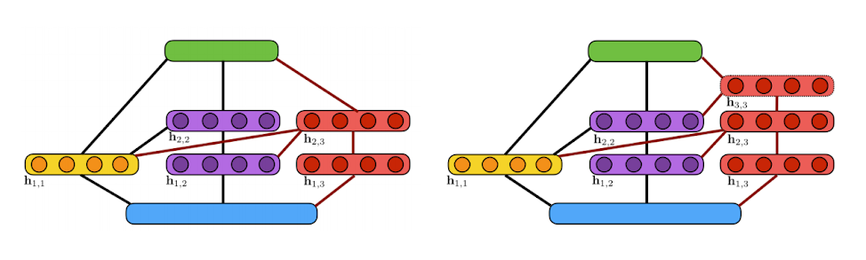

# Algorithm

## Neural architecture search

AutoML is a family of techniques and algorithms seeking to automatically solve
supervised learning tasks. Recently, researchers in AutoML have investigated
whether we can automate learning the structure of a neural network for a given
dataset, automating a task that requires significant domain expertise. This
subdomain known as neural architecture search has seen advances in the
state-of-the-art using reinforcement learning
[[Zoph et al. '17](https://arxiv.org/abs/1707.07012)], evolutionary strategies
[[Real et al., '17](https://arxiv.org/abs/1802.01548)], and gradient-based
methods [[Liu et al., '18](https://arxiv.org/abs/1806.09055)] to learn neural
network substructures. However, in these papers, the high-level structure of the
network generally remains user defined.

> This illustration shows the algorithm’s incremental construction of a
> fully-connected neural network. The input layer is indicated in blue, the
> output layer in green. Units in the yellow block are added at the first
> iteration while units in purple are added at the second iteration. Two
> candidate extensions of the architecture are considered at the third iteration
> (shown in red): (a) a two-layer extension; (b) a three-layer extension. Here,
> a line between two blocks of units indicates that these blocks are
> fully-connected.

## Neural networks are ensembles

Ensembles of neural networks have shown remarkable performance in domains such
as natural language processing, image recognition, and many others. The two
composing techniques are interesting in their own rights: ensemble techniques
have a rich history and theoretical understanding, while neural networks provide
a general framework for solving complex tasks across many domains at scale.

Coincidentally, an ensemble of neural networks whose outputs are linearly
combined is also a neural network. With that definition in mind, we seek to
answer the question: Can we learn a neural network architecture as an ensemble
of subnetworks? And can we adaptively learn such an ensemble with fewer
trainable parameters and that performs better than any single neural network
trained end-to-end?

## Adaptive architecture search

Our algorithm for performing adaptive neural architecture search is AdaNet
[[Cortes et al., ICML '17](https://arxiv.org/abs/1607.01097)], which iteratively
grows an ensemble of neural networks while providing learning guarantees. It is
*adaptive* because at each iteration the candidate subnetworks are generated and
trained based on the current state of the neural network.

We show this algorithm can in fact learn a neural network (ensemble) that
achieves state of the art results across several datasets. We also show how this
algorithm is complementary with the neural architecture search research
mentioned earlier, as it learns to combine these substructures in a principled
manner to achieve these results.

## The AdaNet algorithm

The AdaNet algorithm works as follows: a generator iteratively creates a set of
candidate base learners to consider including in the final ensemble. How these
base learners are trained is left completely up to the user, but generally they
are trained to optimize some common loss function such as cross-entropy loss or
mean squared error. At every iteration, the trained base learners then evaluated
on their ability to minimize the AdaNet objective $F$, and the best one is
included in the final ensemble.

$$\begin{aligned} &F\left ( w \right ) = \frac{1}{m} \sum_{i=0}^{N-1} \Phi \left (\sum_{j=0}^{N-1}w_jh_j(x_i), y_i  \right ) + \sum_{j=0}^{N-1} \left (\lambda r(h_j) + \beta   \right )\left | w_j \right |\\ &\text{where }w_j \text{ is the weight of model } j \text{'s contribution to the ensemble,}\\ &h_j \text{ is model } j,\\ &\Phi \text{ is the loss function,}\\ &r(h_j) \text{ is model } j\text{'s complexity, and}\\ &\lambda \text{ and } \beta \text{ are tunable hyperparameters.} \end{aligned}$$

For every iteration after the first, the generator can generate neural networks
based on the current state of the ensemble. This allows AdaNet to create complex
structures or use advanced techniques for training candidates so that they will
most significantly improve the ensemble. For an optimization example, knowledge
distillation [[Hinton et al., '15](https://arxiv.org/abs/1503.02531)] is a
technique that uses a teacher network's logits as the ground-truth when
computing the loss of a trainable student network, and is shown to produce
students that perform better than a identical network trained without. At every
iteration, we can use the current ensemble as a teacher network and the
candidates as students, to obtain base learners that perform better, and
significantly improve the performance of the final ensemble.

## More information

*   [A step by step walkthrough of the AdaNet algorithm](https://docs.google.com/presentation/d/19NL1nI-MpwysxDsjSNmHbzLnr4NGacw6a8YGo88VA2Y/present?slide=id.g3d1c8865a3_0_0)

<link rel="stylesheet" href="https://cdn.jsdelivr.net/npm/katex@0.10.1/dist/katex.min.css" integrity="sha384-dbVIfZGuN1Yq7/1Ocstc1lUEm+AT+/rCkibIcC/OmWo5f0EA48Vf8CytHzGrSwbQ" crossorigin="anonymous">

