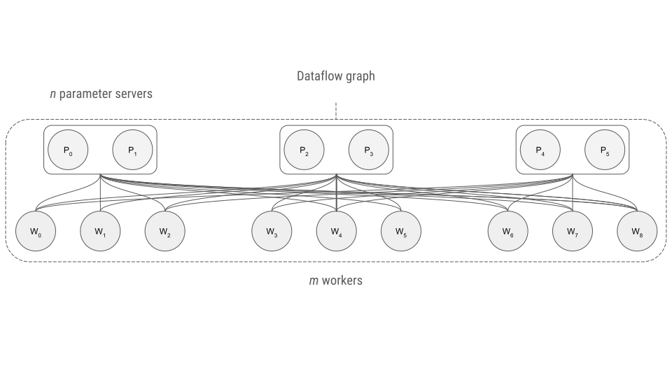
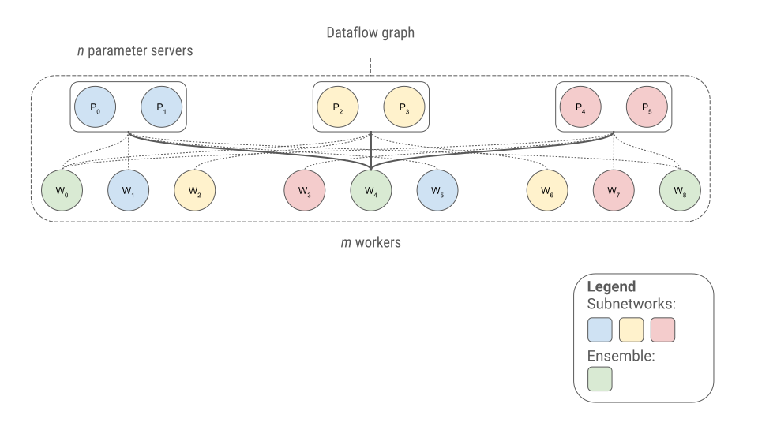

# Distributed training

AdaNet uses the same distributed training model as `tf.estimator.Estimator`.

For training TensorFlow estimators on Google Cloud ML Engine, please see
[this guide](https://cloud.google.com/blog/products/gcp/easy-distributed-training-with-tensorflow-using-tfestimatortrain-and-evaluate-on-cloud-ml-engine).

## Placement Strategies

Given a cluster of worker and parameter servers, AdaNet will manage distributed
training automatically. When creating an AdaNet `Estimator`, you can specify the
`adanet.distributed.PlacementStrategy` to decide which subnetworks each worker
will be responsible for training.

### Replication Strategy

The default distributed training strategy is the same as the default
`tf.estimator.Estimator` model: each worker will create the full training graph,
including all subnetworks and ensembles, and optimize all the trainable
parameters. Each variable will be randomly allocated to a parameter server to
minimize bottlenecks in workers fetching them. Worker's updates will be sent to
the parameter servers which apply the updates to their managed variables.

To learn more, see the implementation at
[`adanet.distributed.ReplicationStrategy`](https://adanet.readthedocs.io/en/latest/adanet.distributed.html#replicationstrategy).

### Round Robin Stategy (experimental)

A strategy that scales better than the Replication Strategy is the experimental
Round Robin Stategy. Instead of replicating the same graph on each worker,
AdaNet will round robin assign workers to train a single subnetwork.

To learn more, see the implementation at
[`adanet.distributed.RoundRobinStrategy`](https://adanet.readthedocs.io/en/latest/adanet.distributed.html#roundrobinstrategy).

<link rel="stylesheet" href="https://cdn.jsdelivr.net/npm/katex@0.10.1/dist/katex.min.css" integrity="sha384-dbVIfZGuN1Yq7/1Ocstc1lUEm+AT+/rCkibIcC/OmWo5f0EA48Vf8CytHzGrSwbQ" crossorigin="anonymous">

