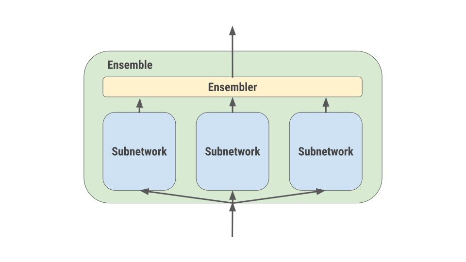
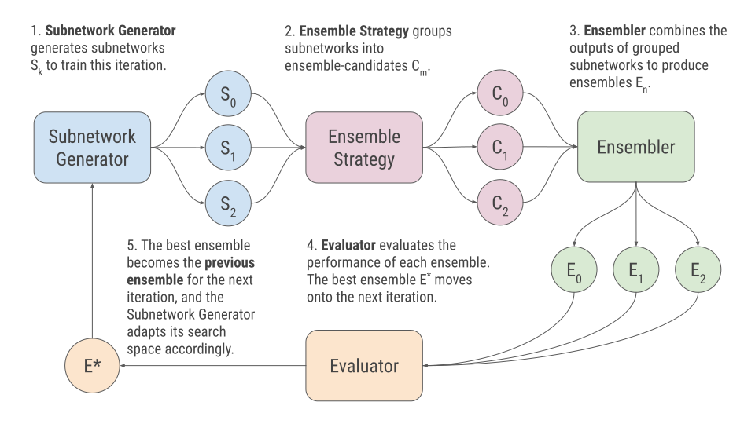
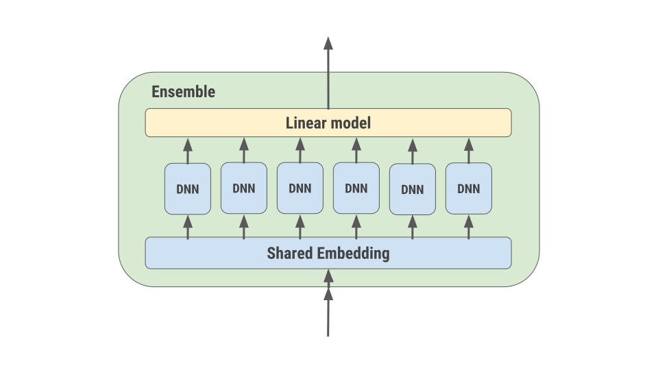

# Overview

AdaNet is an extended implementation of [*AdaNet: Adaptive Structural Learning
of Artificial Neural Networks* by [Cortes et al., ICML
2017]](https://arxiv.org/abs/1607.01097), an algorithm for iteratively learning
both the **structure** and **weights** of a neural network as an **ensemble of
subnetworks**.

## Ensembles of subnetworks

In AdaNet, **ensembles** are first-class objects. Every model you train will be
one form of an ensemble or another. An ensemble is composed of one or more
**subnetworks** whose outputs are combined via an **ensembler**.

Ensembles are model-agnostic, meaning a subnetwork can be as complex as deep
neural network, or as simple as an if-statement. All that matters is that for a
given input tensor, the subnetworks' outputs can be combined by the ensembler to
form a single prediction.

## Adaptive architecture search

    

In the animation above, the AdaNet algorithm iteratively performs the following
architecture search to grow an ensemble of subnetworks:

1.  Generates a pool of candidate subnetworks.
1.  Trains the subnetworks in whatever manner the user defines.
1.  Evaluates the performance of the subnetworks as part of the ensemble, which
    is an ensemble of one at the first iteration.
1.  Adds the subnetwork that most improves the ensemble performance to the
    ensemble for the next iteration.
1.  Prunes the other subnetworks from the graph.
1.  Adapts the subnetwork search space according to the information gained from
    the current iteration.
1.  Moves onto the next iteration.
1.  Repeats.

## Iteration lifecycle

Each AdaNet **iteration** has the given lifecycle:

Each of these concepts has an associated Python object:

*   **Subnetwork Generator** and **Subnetwork** are defined in the
    [`adanet.subnetwork`](https://adanet.readthedocs.io/en/latest/adanet.subnetwork.html)
    package.
*   **Ensemble Strategy**, **Ensembler**, and **Ensemble** are defined in the
    [`adanet.ensemble`](https://adanet.readthedocs.io/en/latest/adanet.ensemble.html)
    package.

## Design

AdaNet is designed to operate primarily inside of TensorFlow's computation
graph. This allows it to efficiently utilize available resources like
distributed compute, GPU, and TPU, using TensorFlow primitives.

AdaNet provides a unique adaptive computation graph, which can support building
models that create and remove ops and variables over time, but still have the
optimizations and scalability of TensorFlow's graph-mode. This adaptive graph
enables users to develop progressively growing models (e.g. boosting style),
develop architecture search algorithms, and perform hyper-parameter tuning
without needing to manage an external for-loop.

## Example ensembles

Below are a few more examples of ensembles you can obtain with AdaNet depending
on the **search space** you define. First, there is an ensemble composed of
increasingly complex neural network subnetworks whose outputs are simply
averaged:

Another common example is an ensemble learned on top of a shared embedding.
Useful when the majority of the model parameters are an embedding of a feature.
The individual subnetworks' predictions are combined using a learned linear
combination:

## Quick start

Now that you are familiar with AdaNet, you can explore our
[quick start guide](./quick_start.md).
